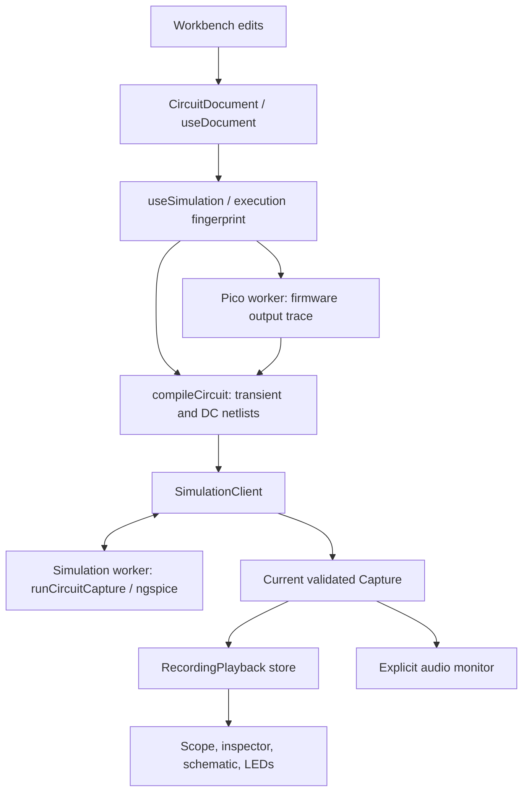

# Pico Labor architecture

This guide describes the implemented system and the decisions future changes should preserve. Start with [AGENTS.md](../AGENTS.md) for contribution and verification guidance and [README.md](../README.md) for setup and user workflows.

Pico Labor is a client-side React/TypeScript application built with Vite. Project editing, ngspice simulation, MicroPython emulation, and recording inspection run locally. There is no application backend or account requirement. Optional folder sync and USB source upload are explicit browser capabilities.

## Find the implementation

Paths below are starting points, not an exhaustive inventory. `src/lib/` contains both reusable domain modules and explicitly named React hooks; it is not an entirely framework-free layer.

| Area | Start here | Related coverage |
| --- | --- | --- |
| Workbench composition and document actions | [App.tsx](../src/App.tsx), [WorkspaceTabs.tsx](../src/components/workbench/WorkspaceTabs.tsx) | [workbench.spec.ts](../tests/e2e/workbench.spec.ts), [workspace-tabs.spec.ts](../tests/e2e/workspace-tabs.spec.ts) |
| Document schema, part catalog, board geometry, connectivity, compiler, example registry | [circuit.ts](../src/lib/circuit.ts): `CircuitDocument`, `PARTS`, `validateDocument`, `resolveTopology`, `compileCircuit`, `examples` | [circuit.test.ts](../tests/circuit.test.ts), [components.test.ts](../tests/components.test.ts) |
| History, browser recovery, folder sync | [use-document.ts](../src/lib/use-document.ts), [use-directory-sync.ts](../src/lib/use-directory-sync.ts), [project-limits.ts](../src/lib/project-limits.ts) | [project-tools.spec.ts](../tests/e2e/project-tools.spec.ts), [pico-workbench.spec.ts](../tests/e2e/pico-workbench.spec.ts) |
| Placement, part artwork, values, navigation | [Breadboard.tsx](../src/components/workbench/Breadboard.tsx), [PartGlyph.tsx](../src/components/workbench/PartGlyph.tsx), [Inspector.tsx](../src/components/workbench/Inspector.tsx), [part-editing.ts](../src/lib/part-editing.ts), [board-viewport.ts](../src/lib/board-viewport.ts) | [part-editing.test.ts](../tests/part-editing.test.ts), [lead-editing.spec.ts](../tests/e2e/lead-editing.spec.ts), [viewport.spec.ts](../tests/e2e/viewport.spec.ts) |
| Capture scheduling and worker protocol | [simulation.ts](../src/lib/simulation.ts), [simulation-client.ts](../src/lib/simulation-client.ts), [simulation.worker.ts](../src/lib/simulation.worker.ts), [simulation-types.ts](../src/lib/simulation-types.ts) | [simulation.test.ts](../tests/simulation.test.ts), [simulation.spec.ts](../tests/e2e/simulation.spec.ts) |
| Analyses, result validation, current descriptors | [simulation-analysis.ts](../src/lib/simulation-analysis.ts), [simulation-results.ts](../src/lib/simulation-results.ts), [simulation-descriptors.ts](../src/lib/simulation-descriptors.ts) | [operating-point.test.ts](../tests/operating-point.test.ts), [recording.test.ts](../tests/recording.test.ts) |
| Device models and custom curves | [timer555.ts](../src/lib/timer555.ts), [lm13700.ts](../src/lib/lm13700.ts), [synth-models.ts](../src/lib/synth-models.ts), `synth-utilities.ts`, `synth-logic.ts`, `synth-timing.ts`; [custom-components.ts](../src/lib/custom-components.ts), [characteristic-curves.ts](../src/lib/characteristic-curves.ts), [component-models.ts](../src/lib/component-models.ts) | Corresponding `tests/*.test.ts`, especially [custom-components.test.ts](../tests/custom-components.test.ts) |
| Measurements, scope rendering, triggering | [measurements.ts](../src/lib/measurements.ts), [scopeTrace.ts](../src/lib/scopeTrace.ts), [trigger.ts](../src/lib/trigger.ts), [Scope.tsx](../src/components/workbench/Scope.tsx), [ScopeAnnotations.tsx](../src/components/workbench/ScopeAnnotations.tsx), [pico/state-timeline.ts](../src/lib/pico/state-timeline.ts), [inspector-traces.ts](../src/lib/inspector-traces.ts) | [measurements.test.ts](../tests/measurements.test.ts), [scopeTrace.test.ts](../tests/scopeTrace.test.ts), [pico-state-timeline.test.ts](../tests/pico-state-timeline.test.ts), [scope-performance.spec.ts](../tests/e2e/scope-performance.spec.ts), [results-navigation.spec.ts](../tests/e2e/results-navigation.spec.ts) |
| Recording data and playback | [recording.ts](../src/lib/recording.ts), [recording-playback.ts](../src/lib/recording-playback.ts), [recording-context.ts](../src/lib/recording-context.ts), [Recording.tsx](../src/components/workbench/Recording.tsx) | [recording.test.ts](../tests/recording.test.ts), [recording-playback.test.ts](../tests/recording-playback.test.ts) |
| Audio monitoring | [audio.ts](../src/lib/audio.ts), [audio-loop.ts](../src/lib/audio-loop.ts), [AudioMonitor.tsx](../src/components/workbench/AudioMonitor.tsx) | [audio-loop.test.ts](../tests/audio-loop.test.ts), [monitor.spec.ts](../tests/e2e/monitor.spec.ts) |
| Automation model, migration, evaluation, editor | [automation-graph.ts](../src/lib/automation-graph.ts), [automation-migration.ts](../src/lib/automation-migration.ts), [automation-runtime.ts](../src/lib/automation-runtime.ts), [automation-signals.ts](../src/lib/automation-signals.ts), [automation-editing.ts](../src/lib/automation-editing.ts), [automations/](../src/components/workbench/automations/) | [automations.test.ts](../tests/automations.test.ts), [automation-flows.test.ts](../tests/automation-flows.test.ts), [automation-flows.spec.ts](../tests/e2e/automation-flows.spec.ts) |
| Circuit tests and execution identity | [circuit-tests.ts](../src/lib/circuit-tests.ts), [circuit-test-request.ts](../src/lib/circuit-test-request.ts), [use-circuit-tests.ts](../src/lib/use-circuit-tests.ts), [execution-fingerprint.ts](../src/lib/execution-fingerprint.ts), [run-circuit-tests.ts](../scripts/run-circuit-tests.ts) | [circuit-tests.test.ts](../tests/circuit-tests.test.ts), [automation-regression.json](examples/automation-regression.json) |
| Pico emulation, editor, traces, USB | [pico/](../src/lib/pico/): `profile.ts`, `client.ts`, `pico.worker.ts`, `runtime.ts`, `electrical.ts`, `language.ts`, `scope-log.ts`, `state.ts`, `serial.ts`; [components/pico/](../src/components/pico/), [ssd1306.ts](../src/lib/ssd1306.ts) | `tests/pico*.test.ts`, `tests/e2e/pico*.spec.ts`, [ssd1306.test.ts](../tests/ssd1306.test.ts) |
| Schematic and exports | [schematic.ts](../src/lib/schematic.ts), [SchemaPanel.tsx](../src/components/workbench/SchemaPanel.tsx), [kicad-export.ts](../src/lib/kicad-export.ts), [kicad-legacy-symbols.ts](../src/lib/kicad-legacy-symbols.ts), [zip-export.ts](../src/lib/zip-export.ts) | [schematic.test.ts](../tests/schematic.test.ts), [kicad-export.test.ts](../tests/kicad-export.test.ts), [schema.spec.ts](../tests/e2e/schema.spec.ts) |
| Editable project documentation and lessons | [documentation.ts](../src/lib/documentation.ts), [DocumentationPanel.tsx](../src/components/workbench/DocumentationPanel.tsx), `src/lib/*-examples.ts` and `src/lib/pico/*example*.ts` | [documentation.test.ts](../tests/documentation.test.ts), [documentation.spec.ts](../tests/e2e/documentation.spec.ts) |
| Shared UI and styles | [components/ui/](../src/components/ui/), [index.css](../src/index.css), [LaborHardware.css](../src/LaborHardware.css), [WorkbenchUX.css](../src/WorkbenchUX.css), adjacent component CSS | Relevant `tests/e2e/*.spec.ts` |

## Runtime and state ownership

The central boundary from the [original design](../plan.md) remains: **the UI owns physical placement, the compiler owns connectivity, and the simulator owns electrical results**.

`useSimulation` snapshots the document by execution fingerprint, compiles and diagnoses it, and schedules a bounded request. Analog auto-update coalesces edits; Pico projects require an explicit run. The optional Pico worker first records firmware outputs, which become electrical drivers in the compiled circuit. The simulation worker runs the analyses and returns a capture only after validating completion. The hook rejects obsolete results before the UI uses them as current.

| State | Owner and lifetime |
| --- | --- |
| Saved project | `CircuitDocument`: physical placement, instruments, probes, firmware, custom models, automation/test definitions, schematic groups, and project documentation. Export, recovery, and folder sync share this representation. |
| Undo/redo and source sessions | `useDocument`: document history and Pico source-session identity. Monaco keeps text-edit history; `changeSource` updates the session without making every keystroke a workbench undo step. |
| Editing/view state | `App.tsx` and feature components: selection, tools, viewport, tabs, scope settings, and dialog drafts. Graph layout and schematic groups are saved presentation metadata, but do not affect execution identity. |
| Execution state | Simulation hook/client and test runner: snapshots, revisions, run IDs, progress, errors, and current captures. These do not become project definitions. |
| Playback state | `RecordingPlayback`, exposed through `useSyncExternalStore`: selected time, speed, loop, and interpolated readings. Only consumers of animated values subscribe. |
| Circuit-test history | `useCircuitTests`: bounded results/recordings; persisted summaries omit raw captures. Saved test definitions remain in the project. |

## Decisions to preserve

These are current contracts distilled from the implementation, tests, and linked design notes. They are not a claim that every proposal in the historical plans was implemented.

### 1. One validated, versioned project format

`validateDocument` is the shared ingress for imported projects, recovery, folder reads, and CLI tests. Documents describe supported parts and physical terminal references; arbitrary SPICE directives and external models are not an extension mechanism. Embedded Pico source is simulated only through the bounded Pico runtime when requested.

The validator accepts schemas 1–4. Schema 2 introduced Pico data, schema 3 custom component definitions, and schema 4 the canonical `automationProgram`. A schema-4 document must not also contain legacy `automations`. `programFor` adapts older automations for execution; `withProgram` writes the new representation when editing it. Optional defaults are read without eagerly rewriting older documents. The optional `board: { columns, rows }` field is supported in schemas 1–4; omission retains the original 30-column, single-row geometry. Columns are bounded to 30/45/60 and rows to 1/2/3. `boardGeometry` owns the cached physical geometry used by validation, placement, connectivity, schematic generation, and the workbench. First-row IDs and existing rail groups retain their meaning; later rows use `r2:` / `r3:` prefixes. Resizing is one undoable document edit, survives export/recovery/folder sync, and refuses to remove holes used by components, wires, probes, or physical voltage-signal references. Clear board keeps the selected dimensions. The viewport’s responsive single-row height is multiplied by the workbench height ratio, so adding rows expands the page instead of shrinking the holes; zoom remains view state. See [breadboard size regressions](../tests/breadboard-size.test.ts) and [browser workflows](../tests/e2e/breadboard-size.spec.ts).

This keeps saved projects portable and avoids silently losing or executing automation definitions twice. New durable fields must survive validation and the existing history/export/recovery/sync paths. Folder connection performs no writes; synchronization is manual and concurrent changes require a user choice.

Evidence: [circuit.ts](../src/lib/circuit.ts), [automation-migration.ts](../src/lib/automation-migration.ts), [use-directory-sync.ts](../src/lib/use-directory-sync.ts), [automation migration design](automation-flows-plan.md#data-and-persistence-design), [project-tools.spec.ts](../tests/e2e/project-tools.spec.ts).

### 2. Explicit topology and bounded educational models

`resolveTopology` merges board strips and wire endpoints, not visual crossings or component leads. Rails are split every 15 columns and unpowered until wired; each added row has independent strips and rails. Growing the board never connects existing groups. Store probe attachments as physical terminal IDs; generated SPICE node names are derived. The compiler diagnoses floating nodes, ideal-source shorts, and missing required supply connections instead of adding invisible repair wiring. Schematic generation uses the same topology; it is a derived view, not a separate electrical document.

Named ICs are educational approximations with documented pinouts, supplies, startup behavior, and omissions. Custom characteristics are bounded data compiled through the existing model path. Unsupported current/power measurements remain unavailable. These choices keep the displayed construction and numerical claims explainable.

Custom resistors obey `V = I × R(abs(I))`. Custom capacitance is differential: charge is `Q(V) = ∫ C(u) du`, not `C(V) × V`. The adapter in [component-models.ts](../src/lib/component-models.ts) keeps the solver law, saved-current vector, and frozen measurement descriptor together so compilation and inspection agree.

Evidence: [hardware specification](hardware-spec.md), [engine model notes](engine-notes.md), [circuit.test.ts](../tests/circuit.test.ts), [schematic.test.ts](../tests/schematic.test.ts), and the corresponding device-model tests.

### 3. Worker isolation and complete, current results

The engine's asynchronous API still performs work in its caller's context, so ngspice initialization and solving belong in `simulation.worker.ts`. `SimulationClient` allows one active request and one replaceable queued request; watchdogs terminate an unresponsive worker. Revisions, run ownership, and cleanup prevent late results from becoming current.

A production capture performs a separate `.op` solve followed by `.tran`, from the same snapshot with matching node/device names. The engine wrapper exposes only the current plot, so a transient cannot substitute for the separate initial DC analysis. Publish the combined result only after both succeed and the transient reaches the requested endpoint. Missing vectors, invalid values, and limit failures must stay errors, not partial successful captures.

Each independent capture starts from its defined operating point. Stored charge and other solver state do not carry across captures or edits; playback only revisits completed data.

Evidence: [engine runtime boundary](engine-notes.md#runtime-boundary), [simulation-analysis.ts](../src/lib/simulation-analysis.ts), [simulation-client.ts](../src/lib/simulation-client.ts), [simulation.test.ts](../tests/simulation.test.ts), [simulation.spec.ts](../tests/e2e/simulation.spec.ts).

### 4. Semantic identity separates electrical edits from presentation

`executionFingerprint` determines whether a capture or test still describes the project. It includes electrical topology and values, relevant firmware, models, duration, reachable flows, fixtures, and engine/evaluator versions. It excludes titles, explanatory text, wire colors, schematic groups, and graph labels/layout. Board dimensions participate because resizing can renumber the compiler’s generated nodes; existing captures must be replaced before measurements use the new mapping. Explicit default dimensions and omitted legacy dimensions have the same identity. A terminal-bound test does not acquire a dependency on an unrelated scope-probe move; a test using a channel alias does depend on that channel's binding.

Preserve this distinction when adding fields: electrical edits stale affected results immediately, while renaming or arranging content must not launch a solve or cancel an equivalent manual capture. Do not replace this key with a serialization of the whole document.

Evidence: [execution-fingerprint.ts](../src/lib/execution-fingerprint.ts), [circuit-tests.test.ts](../tests/circuit-tests.test.ts), [schema-groups.test.ts](../tests/schema-groups.test.ts), [simulation.spec.ts](../tests/e2e/simulation.spec.ts).

### 5. One causal automation evaluator for captures and tests

Simple editing and the Flow editor produce the same graph model. Execution lives in `automation-runtime.ts` and `automation-signals.ts`, independent of React Flow. Browser captures and the Node circuit-test worker both use `runCircuitCapture`; fixes to evaluator or measurement semantics belong in the shared path.

Actions, observations, and deadlines use simulation time. When an action changes a future trajectory, the evaluator commits the earliest causal event and resolves the future again. Each solver pass starts from the original DC state and produces a continuous trajectory with the committed actions. Splicing separately solved segments would lose capacitor/inductor history. Playback loops only replay recorded events.

Suites freeze a project snapshot, apply each test's fixture, and run cases serially. Ordinary auto-capture pauses while the suite runs. Tests must not overwrite saved controls, and missing evidence or exhausted budgets must not become passing results. Graphs and invocations are bounded; recursive/unbounded programs are outside the contract.

Evidence: [automation guide](automations.md), [execution design](automation-flows-plan.md#graph-model-and-execution-contract), [simulation-analysis.ts](../src/lib/simulation-analysis.ts), [automation-flows.test.ts](../tests/automation-flows.test.ts), [circuit-tests.test.ts](../tests/circuit-tests.test.ts).

### 6. Raw electrical data, replay, rendering, and audio have separate jobs

Captures retain all accepted adaptive timestamps and saved vectors. Channels reuse recording arrays; interpolation uses adjacent solver rows. Measurements account for nonuniform time spacing. Rendering may summarize a dense trace for pixels, but that must not downsample the underlying recording or remove narrow peaks from the displayed envelope.

Playback uses an external store capped at 30 visual updates per second, keeping the workbench and editor out of the animation loop. Scope waveform drawing is cached separately from hover, cursor, and playhead overlays. Avoid full-array validation/scanning on each cursor or pointer update.

Results integrates the playback controls, voltage traces, Pico log lanes, and sampled variable-change annotations around one recording clock. Their shared visible interval supports zoom and explicit pan; hover compares values without moving the playhead. On the voltage graph, rectangle zoom supersedes the earlier plain-drag scrubbing and Shift-drag range selection: a click seeks, Shift-drag scrubs, and Space-drag pans time and voltage without seeking. Double-click restores the previous rectangle view, or doubles the time interval when no rectangle history remains. Escape cancels a gesture and restores the starting pan view. This keeps inspection and navigation distinct while retaining scrubbing and keyboard access.

The full-capture transport remains independent of the visible interval. Scope height, time window, voltage transform, zoom history, and expanded workspace are view state, outside the saved document and undo history, so these interactions preserve project compatibility and never require a solve. Voltage labels and scales reflect the transformed view; **Auto volts** and manual voltage-scale changes reset vertical zoom and pan. **Fit** also restores the full time interval and clears rectangle history. Pico log lanes keep their own numeric scales. Explicit panning can leave the playhead outside the view; subsequent playback or seeking follows it, while trigger changes deliberately reframe the capture. Rectangle previews use overlays rather than repainting waveform paths.

Pico logs hold the last explicitly recorded numeric sample, while variable annotations describe retained sampled snapshots; neither interpolates program state or substitutes for a solved voltage. Build the variable-change index once per capture and bound visible marker groups, keeping every retained snapshot accessible through zoom and change navigation. Incomplete or unavailable state remains visible. Share the hover time and cached trace lookups rather than rescanning captures in pointer handlers.

Audio is an explicit, bounded preview of a completed capture. Its resampling, DC removal, gain limiting, and fades do not modify measurement arrays. Sustained loops require verified repeating cycles. Electrical edits stop playback/listening and stale measurements are hidden until a current capture exists.

Evidence: [performance analysis](performance.md), [recording.ts](../src/lib/recording.ts), [scopeTrace.ts](../src/lib/scopeTrace.ts), [recorded Pico state](pico-runtime.md#inspect-recorded-application-state), [audio notes](engine-notes.md#audio-monitor), [scope-performance.spec.ts](../tests/e2e/scope-performance.spec.ts), [results-navigation.spec.ts](../tests/e2e/results-navigation.spec.ts), [results-layout.spec.ts](../tests/e2e/results-layout.spec.ts), [pico-state-timeline.test.ts](../tests/pico-state-timeline.test.ts), [audio-loop.test.ts](../tests/audio-loop.test.ts).

### 7. Pico simulation is an output capture, USB transfer is separate

The Pico worker runs bundled MicroPython firmware in `rp2040js`, records GPIO/PWM and supported display/log/state events, and supplies a trace to the electrical compiler. Analog solver results do not feed back into firmware inputs or ADC reads. This is a sequential capture pipeline, not continuous bidirectional co-simulation. Firmware restarts for each capture.

The editor and language tooling load separately from the ordinary workbench. Runtime assets are versioned and checksum-verified through `public/pico/manifest.json`; firmware, stubs, profile, checksums, and licensing notices must remain consistent.

Web Serial transfer in `pico/serial.ts` and `PicoTransfer.tsx` is a separate explicit operation that uploads source to a physical Pico. It does not turn the simulator or automations into a physical hardware controller.

Evidence: [Pico runtime guide](pico-runtime.md), [assets.ts](../src/lib/pico/assets.ts), [Pico implementation plan](pico-implementation-plan.md), [pico.test.ts](../tests/pico.test.ts), [pico-serial.test.ts](../tests/pico-serial.test.ts).

### 8. Resource bounds are part of correctness

Electrical captures fail when they exceed sample, value, or execution budgets; accepted electrical recordings are not silently truncated. Pico diagnostic data has explicit exceptions: console output may truncate with a marker, and passive variable snapshots may report incomplete or unavailable values while the electrical capture continues. Keep these distinctions visible. Preserve limits across validation, compilation, execution, and result extraction; increasing one requires checking the dependent budgets and measuring representative workloads.

| Budget | Authoritative location |
| --- | --- |
| Project/source bytes | [project-limits.ts](../src/lib/project-limits.ts): `PROJECT_LIMITS`; validation checks the formatted representation and folder writes recheck serialized size |
| Parts, wires, topology, netlist expansion | [circuit.ts](../src/lib/circuit.ts): `validateDocument`, `compileCircuit` |
| Duration, samples, numeric payload, worker deadlines | [simulation-types.ts](../src/lib/simulation-types.ts): `SIMULATION_LIMITS` |
| Custom definitions and curve constraints | [custom-components.ts](../src/lib/custom-components.ts): `CUSTOM_LIMITS` |
| Graph size, call depth, committed events, solver passes | [automation-graph.ts](../src/lib/automation-graph.ts): `GRAPH_LIMITS` |
| Emulator instructions, events, trace bytes, deadlines | [pico/runtime.ts](../src/lib/pico/runtime.ts): `PICO_LIMITS` |

Numeric payload limits are not a total process-memory guarantee: the solver, raw parser, and worker transport also need memory. Use the measurements and reproduction commands in [performance.md](performance.md) as evidence, not universal timing promises.

## Common change paths

- **Add or change a part:** start with `ComponentKind`/`PARTS`, footprint validation, and compiler/model dispatch in `circuit.ts`. Follow through current descriptors, recording behavior, library/icon/glyph/inspector UI, schematic/KiCad symbols, and an editable example. Search a similar existing kind across `src/` and `tests/` to find all integration points. Verify actual ngspice behavior, invalid wiring, placement/import, and any unsupported readouts.
- **Add saved metadata or controls:** update the shared type and validator, choose whether it affects `executionFingerprint`, and verify undo/redo, export/import, recovery, and folder sync. Test older schemas and defaults; do not fork a second serializer for one UI feature.
- **Change flow semantics:** update validation, migration/editing, runtime/signals, fingerprints, and shared browser/CLI coverage together. Preserve fixture isolation, unavailable outcomes, event ordering, and budgets.
- **Change scope or playback:** keep sampling/statistics in library helpers and rendering in consumers. Use numerical tests plus the canvas redraw/access-bound regressions in the performance tests.
- **Change Pico assets or runtime:** consult `pico-runtime.md`, the asset manifest, profile, stubs, and notices together. Verify firmware capture and electrical integration; test USB transfer separately if its protocol changes.

## Design history and documentation upkeep

| Reference | How to use it |
| --- | --- |
| [plan.md](../plan.md) | Original product scope and UI/compiler/simulator separation; many later features exceed that initial scope. |
| [hardware-spec.md](hardware-spec.md) | Virtual board topology and distinctions from physical LABOR hardware. |
| [engine-notes.md](engine-notes.md) | Current solver integration, numerical assumptions, models, measurement/audio behavior, and provenance. |
| [performance.md](performance.md) | Reasons for adaptive capture and rendering choices, local measurements, and reproduction commands. |
| [pico-implementation-plan.md](pico-implementation-plan.md) / [pico-runtime.md](pico-runtime.md) | Original milestones and deferred feedback work / current supported behavior. |
| [custom-components-plan.md](custom-components-plan.md) | Rationale and constraints for implemented curve models; verify details against current schema/compiler. |
| [automation-flows-plan.md](automation-flows-plan.md) / [automations.md](automations.md) | Graph/test design decisions and release history / current usage and CLI guide. |

When changing an architectural contract, update its decision here and the relevant detailed guide in the same change. Explain the problem, chosen behavior, tradeoff, compatibility/migration impact, and tests that establish the new contract. Mark the old decision as superseded when it is replaced. Keep proposed work clearly labeled and retain links to historical rationale; a plan alone is not proof of current behavior.
