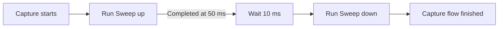
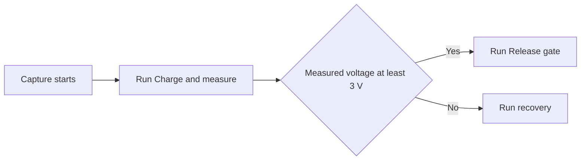

# Automation flows and circuit tests implementation plan

Status: first-release implementation delivered, 2026-10-03. The shared schema, causal runtime, Simple/Flow editors, circuit test runner, report exports, and regression example are implemented. This design remains the target contract; see `docs/automations.md` for delivered behavior and measured budgets. Optional automatic checking remains deferred. Human usability timing targets have not been measured. The release checklist below must be treated as a verification checklist, not a claim that every item has been proven. Original baseline: revision `afecb23`.

Build one automation system with two complementary editing views: **Simple** for the existing When → Then setup, and **Flow** for dependencies, measurements, and branching. Use the same flows as the stimulus and checks for repeatable circuit tests. React Flow supplies the graph editor, styled as part of LABOR; the circuit simulation remains responsible for electrical behavior.

The default path should remain short: choose when something happens, choose what changes, save, and simulate. A user adds complexity only when needed, through **After another automation**, **Add next step**, **Use result**, or **Use as test**. Tests add explicit starting settings, a recording duration, and measurable expectations to the same underlying model.

## Product decisions

| Question | Proposed decision |
| --- | --- |
| Does every user need to draw nodes? | No. Keep the Simple editor as the default creation path. It edits the same definitions and connections shown in Flow. |
| What counts as an automation result? | Completion status and time, plus explicitly named measurement outputs. Completing a knob movement does not imply that the circuit has settled or passed a check. |
| How does B depend on A? | Connect an output of the existing A invocation to B. B may wait for A to finish, follow a condition on A's result, or use a measured value from A. |
| Can automations be reused? | Yes. A named automation can be called from the ordinary capture flow and from multiple tests. Definitions are shared; every explicit call has its own execution identity. |
| What is a circuit test? | A saved case that runs a flow against a fresh circuit state with explicit settings and at least one required expectation. |
| Do tests use the current project circuit? | Yes. They verify the current topology, parts, custom models, and firmware, with declared test overrides. They do not keep testing a hidden copy of the old circuit. |
| When do tests run? | Explicit **Run test** and **Run all tests** by default. An optional **Check after circuit changes** setting can follow once cancellation and resource limits work reliably. |
| Is the first release a general programming environment? | No. It supports finite graphs, typed values, explicit waits, conditions, and reusable calls. Loops, scripts, arbitrary expressions, and physical hardware control are outside this release. |

## Existing foundation and required changes

| Area | Current behavior | Consequence |
| --- | --- | --- |
| Definitions | [`automations.ts`](../src/lib/automations.ts) allows 24 enabled or disabled definitions, each with one time or CH1/CH2 voltage trigger and one bounded control action. | Preserve every existing trigger, target, range, and simple creation path. Introduce graph definitions without maintaining two execution engines. |
| Electrical actions | CV, oscillator amplitude/frequency, gate, potentiometer, and switch actions become control timelines in [`circuit.ts`](../src/lib/circuit.ts). Later actions replace earlier movement on the same control. | Reuse timeline generation and the existing electrical models; define completion, interruption, and conflict outcomes. |
| Causal execution | [`simulation-analysis.ts`](../src/lib/simulation-analysis.ts) runs a full transient trajectory, commits the earliest voltage events, recompiles, and repeats from the original DC state. | Extend this causal process. Concatenating independent captures would incorrectly reset capacitor and inductor state within a flow. |
| Recording | [`simulation-types.ts`](../src/lib/simulation-types.ts) and [`recording.ts`](../src/lib/recording.ts) retain solver samples, all recorded node voltages, and supported current descriptors. | Measure and assert against original samples. Stable circuit references can make tests independent of CH1/CH2 placement. |
| Measurement helpers | [`measurements.ts`](../src/lib/measurements.ts) provides interpolation, time-weighted mean, extrema, and a guarded frequency estimate. | Reuse these algorithms where their semantics match; extend them with bounded windows and explicit validity results. |
| Worker scheduling | [`simulation-client.ts`](../src/lib/simulation-client.ts) supports one active request and one replaceable pending request. | Add a serial test-suite coordinator. Repeatedly submitting every test to the existing client would lose queued work. |
| Persistence | [`use-document.ts`](../src/lib/use-document.ts) supplies recovery and 80 history entries; schema versions 1–3 are accepted. Projects have a 200,000-byte limit. | Add a versioned graph schema, compact layout storage, and strict migration. Keep reports and recordings outside project JSON. |
| Freshness | [`simulation.ts`](../src/lib/simulation.ts) currently keys captures from the entire serialized document plus duration. | Introduce semantic execution fingerprints. Moving a node or renaming a flow must not launch a new solve or invalidate a passing result. |
| UI | [`AutomationsPanel.tsx`](../src/components/workbench/AutomationsPanel.tsx) offers a simple dialog, summaries, status, undo/redo, and event links into Results. | Extend these conventions and preserve the existing workflows. |
| Pico | Firmware produces a trace before analog simulation; circuit-fed GPIO and ADC inputs are unsupported. | Tests can verify supported firmware outputs and their analog effects. This work does not introduce electrical feedback into firmware. |

## User experience

### Keep simple setup familiar

Keep **Automations** in the workspace navigation. Inside it, provide **Automations** and **Tests** sections. The Automations section has a **Simple / Flow** view switch, with Simple selected initially. Remember that preference locally.

The Simple view retains the current list of named automation cards, enable switches, concise summaries, and last-run status. Each row represents a capture invocation, with its own start rule and enable state. Reusable definitions without a capture invocation appear in a library with **Add to capture**; multiple invocations of one definition have distinct labels. Shared-definition edits show their other uses before saving. **Add automation** opens the familiar form:

1. **When**: at a time, when a voltage crosses a threshold, or after another automation.
2. **Then**: change a control, with its value and optional duration.
3. Review the generated sentence and **Save automation**. Generate a useful name automatically; allow editing it.

Expose advanced options only when relevant. Choosing **After another automation** reveals the predecessor, outcome, and optional delay. Completion is the default outcome. A result condition appears only when the predecessor exports a compatible measurement. A switch target selector lists placed switches; it does not ask for an internal ID.

For example: “After Charge capacitor finishes, wait 5 ms, then close S1.” The editor creates the dependency and delay automatically. Existing independent automations retain their original capture-relative times.

Show a small read-only flow preview below the sentence. **Open in Flow** opens the same saved automation. Switching views never copies or converts executable state. More advanced definitions appear in the Simple list with a readable summary and **Edit flow**; never flatten a branching graph into an incomplete form. If later edits make it representable again, the form can become available again.

### Make dependent flows easy to build

The Flow view initially shows the project capture graph: **Capture starts**, the named automations it invokes, and their dependencies. Named automation cards show their trigger/action summary and useful output handles. Opening a card drills into its definition using a breadcrumb such as **Capture / Charge capacitor**. The same editor renders both levels.

Offer **Add next step** on an output and **Insert step** on an edge. These actions create, connect, and position nodes together. The inspector's **Starts after** and **Use result from** selectors provide equivalent actions without dragging handles. Dragging a connection into empty space opens a filtered step picker. Invalid connections explain the problem in plain language, such as “This step needs a voltage; Charge capacitor returns a time.”

Use left-to-right execution, labeled outcomes, restrained edge routing, a fit button, zoom controls, and an optional minimap for larger flows. Provide **Arrange flow** as an explicit action; opening a graph must not rearrange a user's layout. A deterministic layered layout is enough for the finite graphs in this release; a more elaborate layout library is optional.

The desktop layout consists of a compact flow list, the canvas, a selected-step inspector, and a collapsible run-details area. Collapse the list or inspector as space decreases. On narrow screens, use a full-width canvas with a drawer inspector and an ordered step list offering the same editing operations. Respect the existing 650 px automation breakpoint and the wider workbench breakpoints.

### Turn an automation into a test

**Use as test** opens a short setup sequence:

1. **Exercise the circuit**: the chosen automation and its prerequisite steps are already selected. Show the included dependency chain, initial control settings, and duration. Capture these controls into explicit test settings that can be edited later. Offer the whole capture flow or a standalone definition as explicit alternatives.
2. **Check the result**: choose a signal by clicking a terminal/component or selecting a named signal, choose an expectation, and set its timing and tolerance.
3. **Name and run**: show a plain-language summary, save the case, and run it.

Example: “Run Charge capacitor. C1 voltage must cross 3 V within 25 ms of the gate going high.” The wizard creates a test flow containing calls to the shared automations and a required expectation. It saves the selected prerequisite wiring and invocation start settings as the test's scenario, while retaining references to the shared action definitions. This fixes the test's intended timing without duplicating action settings. Show this distinction: shared action changes affect all callers; later edits to ordinary capture wiring do not rewrite a saved test scenario. Choosing to call the whole capture flow instead deliberately follows that flow's future changes.

The Tests section lists each test's name, status, short expectation summary, last run, and duration. Provide **Add test**, **Run test**, **Run all tests**, and **Rerun failed**. An empty state offers a few templates: **Value after a step**, **Reaches a threshold**, **Stays within a range**, and **Oscillator frequency**. The Flow view remains available for multiple checks and conditional scenarios.

Allow **Add expectation from recording** on a selected value or time window. Suggest a target from the measurement, but require an explicit expected range/tolerance before saving. Capturing current behavior is a convenience for authoring, not evidence that the behavior is correct.

### Explain every outcome

Nodes show **Waiting**, **Running**, **Done**, **Failed**, **Timed out**, **Interrupted**, or **Skipped**, with an icon and text. During calculation, status means progress through simulation analysis, not elapsed wall time on a moving circuit. On a completed recording, scrubbing can reveal the statuses that had occurred by the cursor time without re-executing anything.

Selecting a failure reveals its details and associated node. **Inspect recording** opens the relevant recording range in Results with a return link to the test. Show the expected condition, actual value, tolerance, observation interval, and the first violating sample or crossing when available. A failure message should read, for example: “Expected C1 voltage ≥ 3 V within 25 ms after Gate on; highest observed value was 2.61 V.”

Preserve the existing action-event markers and their seek behavior. Add distinguishable markers for completed measurements, expectation failures, and deadlines. Include a textual event list so dense annotations and color differences are never the only way to inspect a run.

## Matching the application style

Use the existing automation surface as the visual reference: dark green panel `#252d28`, border `#475347`, text `#e5ebdf`, secondary text `#b0bcaf`, and accent `#c6db94`. Extract these existing values into shared automation CSS variables and use them in the form, canvas, nodes, inspector, and test list. Keep Geist, Lucide icons, 5–9 px corner radii, compact spacing, and the current 36–39 px control heights. Do not copy the miniature hardware's very small label sizes into the editor.

Use a subtle dotted canvas, dark node surfaces, and a narrow icon/accent area. Different step types need labels and icons, with restrained color differences. Selection and keyboard focus need different visible treatments. Pass/fail status uses the application's success, warning, and error palette together with text; the entire canvas should not become a multicolored diagram.

Use `@xyflow/react` with custom nodes and scoped CSS. Its supported theme variables and custom classes can map the graph's surfaces, edges, handles, and controls to the app's appearance. Import the required stylesheet in an order compatible with the existing Tailwind setup. [React Flow theming](https://reactflow.dev/learn/customization/theming)

Retain React Flow's keyboard focus and navigation support, and customize its accessibility descriptions. Add application-level keyboard operations for inserting steps, choosing dependencies, editing properties, and deleting connections. Use visible connection labels and useful names such as “Charge capacitor, completed output.” Verify focus restoration when closing inspectors and dialogs. [React Flow accessibility](https://reactflow.dev/learn/advanced-use/accessibility)

Respect reduced motion. Keep run animation subtle and optional. Use `nodrag` and appropriate interaction isolation for node controls, and scope Delete, arrows, Space, and undo shortcuts so editing a flow cannot accidentally alter the breadboard or control playback.

Use a polite live region for run start/completion, invalid connections, and meaningful selection changes; never announce every solver event. Restore focus after deleting a node and after returning from recording inspection, as well as after closing dialogs and inspectors.

## Graph model and execution contract

### One model for capture flows and tests

Store named flow definitions and explicit call nodes. A project has one capture flow; the normal Simulate action runs it. Every circuit test references its own entry flow. A named automation can be called by either. Simple mode recognizes a small entry pattern plus its called definition: the capture flow holds Wait for time or voltage → Run automation, while the reusable action definition is Start → Action → Finish. More advanced reusable definitions can contain their own waits and other steps.

In the capture flow, independent simple automations are sibling paths from Capture starts through their start waits to their calls. The overview can collapse each recognized wait/call pair into one named card. Changing B to **After A** replaces B's previous start wait with A's outcome and the chosen relative delay. It does not leave B's old absolute trigger in place or modify other invocations of B's shared definition. Saving that change is one atomic graph edit. This lets the project canvas show dependencies without forcing every user to manage reusable definitions. Definitions used only by tests remain available in the automation library but do not run in ordinary captures.

Enable/disable belongs to an invocation in the capture flow or to a test case. Disabling the ordinary capture use of an automation does not secretly disable the same definition inside a test. Disabling a prerequisite skips its dependent invocations with a visible reason; it never counts as successful completion.

### Steps in the first release

| Step | Purpose and important settings | Outputs |
| --- | --- | --- |
| Start | Entry into a capture, test, or called automation. | Start time and declared input values. |
| Wait | Delay from activation, wait until a capture-relative time, or watch for a level/crossing with a deadline. Show the time reference explicitly. | Ready time, observed value if applicable, or timed out. |
| Action | The existing six action targets, with their current bounded values and duration semantics. | Completed time and commanded value, or interrupted/error. |
| Measure | Sample a signal at a time or calculate a value over a window: min, max, mean, peak-to-peak, or supported frequency. | A named, typed measurement with units and its observation interval. |
| Condition | Compare an available result with a constant or compatible result using a small operator picker. | Yes or No. |
| Expect | Evaluate an explicit signal/result requirement with timing and tolerance. | Passed or Failed, plus actual measurement and evidence. |
| Join | Wait for all selected successful paths, or the first successful path. | Ready and the contributing path identities. |
| Run automation | Call a named definition with validated inputs. Drill into it for editing. | Completed and exported results, or timed out/interrupted/error. |
| Finish | Declare completion and map named outputs from executed predecessors. | The invocation result. |

Group palette entries as **Start and wait**, **Change controls**, **Measure and check**, and **Flow**. The Simple form hides these implementation categories.

### Dependencies and results

Execution edges answer “when may this step run?” Value bindings answer “which result does this field use?” Display execution edges as solid lines; show dashed labeled result connections when their source or destination is selected, with an option to show all. Store both relationships in validated domain data.

Every run is identified by the run ID and invocation path. Each node executes at most once per invocation. Following A's completed output uses that existing A execution; it does not call A again. Two explicit Run automation nodes pointing to the same definition do produce two executions, displayed as separate invocations.

Action completion has a precise meaning:

- A ramp completes when its target is reached. An instantaneous change completes after the existing short electrical transition, currently 1 µs.
- A gate pulse completes after its return-low edge. A held gate-high action completes after reaching high; the held state continues.
- An interrupted ramp or canceled pulse release does not emit a successful completion result.
- A completed action reports its commanded control value. A **Measure** or **Expect** step is required to establish the actual electrical response.

Return typed values such as voltage, current, frequency, elapsed time, boolean, and ratio. Store numeric quantities in SI units and format them for users. Initially allow constants, compatible prior outputs, and declared call inputs. Reject incompatible units and out-of-range control values; never silently clamp a measured value into an action. Exclude arbitrary JavaScript and user-written SPICE expressions.

A result is usable only after its producing node completes, and only on paths where that result exists. Validate dominance and branch availability: a value produced only on Yes cannot be consumed after an unrelated No path. Join outputs must declare which values are guaranteed. The first-success join can expose a tagged winning result; it cannot imply that all branches produced values.

Conditions are routing decisions; expectations are test requirements. Routing through an expectation's Failed output may run cleanup or collect more evidence, but cannot erase the failure from the test verdict.

### Time and ordering

All delays, deadlines, observation windows, and recorded event times use simulation time. Wall-clock timeouts only protect the worker and are reported as execution errors.

Use capture start as the reference for migrated time triggers. Default new delays and windows to the individual node's activation time, so consecutive 5 ms waits take 10 ms. A Start node activates at its invocation's start. Explicit **From automation start** and **At capture time** options remain available. If a prerequisite completes after a chosen absolute time, report a missed deadline; do not run retrospectively. The UI must always show the selected reference.

A crossing requires a real transition in the chosen direction at or after arming; a signal already above the threshold is not a crossing. Offer **Is above/below** separately for level-based waits that may succeed immediately. A short stability interval or hysteresis is optional and visible when used. Never silently add it to migrated triggers.

At the same timestamp, use a persisted execution order and stable invocation path, never canvas position or incidental array sorting. Process ready pure steps in that order. Resolve measurement-dependent actions against a valid causal waveform; after a new electrical action, invalidate future observations and solve again before making dependent electrical decisions. Bound zero-delay step propagation to prevent runaway processing.

Fan-out starts independent paths. A Join must explicitly choose **All succeed** or **First succeeds**; ordinary nodes cannot acquire ambiguous multiple execution inputs. All waits for every required input and closes as blocked as soon as a mandatory input closes unsuccessfully. First succeeds emits once; remaining already-started branches continue. If every input closes without success, First also closes unsuccessfully. Propagate those terminal outcomes downstream immediately. Untaken condition outputs close as skipped. Neither join erases a failed required expectation.

Reaching Finish requests completion of that invocation. Publish successful call outputs only when all activated branches have reached terminal outcomes, all declared outputs are available, and every activated required step has completed successfully or taken an explicitly permitted recovery path. A wait's timeout or an action's interruption is handled only when its matching recovery edge is connected and that recovery path completes. This can support an intentional fallback scenario; it cannot satisfy a separate expectation that the original action or crossing occurred. Failed required expectations remain sticky, and solver/configuration errors are not recoverable routing outcomes in this release.

First succeeds permits downstream work to begin early but does not abandon its other started branches. A losing branch's explicitly handled timeout does not invalidate the successful join; an unhandled required failure still prevents successful invocation completion. An unresolved required branch prevents successful return; at the capture deadline it produces an incomplete or timeout result. Explicit early-return/cancel-branch behavior is deferred. Ordinary control values continue to hold after a flow finishes, and the capture may continue recording to its configured end.

Reject graph cycles, self-links, call recursion, and cyclic value dependencies in the first release. React Flow can give immediate connection feedback; the domain validator must enforce the same rules for imports and headless runs. [React Flow cycle prevention](https://reactflow.dev/examples/interaction/prevent-cycles)

### Shared controls and incomplete runs

Detect overlapping writes to the same target across concurrent paths. New flows default to a conflict error when ordering is ambiguous. Offer an explicit **Replace current action** policy for intentional interruption. A statically ordered sequence is valid, and an interrupted action's descendants receive an interrupted/skipped outcome.

Preserve the existing later-action-wins behavior and list-order tie breaking for migrated independent automations using an explicit compatibility policy. Display it if the user edits overlapping actions. A new test that imports this behavior must show that policy and any resulting interruptions; it must not silently treat an interrupted required step as completed.

Nodes waiting when the recording ends receive an explicit timed-out or incomplete outcome. In ordinary captures, retain the existing circuit result and show why an automation did not fire. In a test, a required unmet timing expectation fails; missing signals, invalid references, unsupported measurements, solver errors, and insufficient data prevent a pass.

## Circuit test specification

### Reproducible inputs and isolation

Each test records a name, optional description/tags, enabled state, entry flow, capture duration, and fixture settings. Default the fixture to explicit initial front-panel controls captured when the test is created. Allow deliberate per-test part-value or potentiometer/switch overrides through a typed picker. Topology, part definitions, custom curves, and firmware remain the current project unless a specific supported override is displayed.

Show whether every setting is fixed for the test or follows the project. A test intended to verify a resistor value can follow the current project value; a test intended to exercise several operating conditions can supply explicit values. Deleting or changing a referenced part makes its override invalid instead of silently dropping it.

Each case starts from a freshly calculated DC operating point and reset firmware/runtime state, then runs one continuous transient scenario. Never carry control endpoints, stored charge, logs, pending gates, or measurement caches from a previous test. Fresh DC does not mean zero capacitor voltage; it means the equilibrium of the declared starting circuit. Arbitrary initial charge and cross-test state are separate future features.

Tests execute only the flows explicitly referenced by their entry flow. Unrelated automations enabled for ordinary captures do not run implicitly. The wizard can include the whole capture flow when that is the user's chosen scenario, and shows the choice.

The suite freezes one project snapshot at start and runs cases serially. Editing during a suite does not mutate that snapshot; results become stale for affected tests and a later run uses the new project. Cancel stops the active worker request and remaining queue, records cancellation, and restores availability of the normal capture controls. Tests do not overwrite saved circuit values or the current ordinary recording. Selecting **Inspect recording** explicitly opens a labeled test recording in Results, with a way back to the ordinary capture.

### Stable signal selection

Support named project signals resolved from stable terminal references, a voltage difference between two terminals, and supported component branch currents. Resolve topology and generated SPICE vector names at run time. Rewiring a part should change its measured behavior while preserving a test attached to that part's pin; deleting it should report a broken reference.

Keep CH1/CH2 as convenient choices and preserve their meaning in migrated automations. For new tests, default to the actual referenced terminals so moving a scope probe does not change what is tested. If a user deliberately selects a live channel alias, display that it follows the probe. Expose only measurements supported by the recording descriptors; do not invent missing current or power channels.

### Expectations and numerical meaning

| Expectation | Example | Evaluation rule |
| --- | --- | --- |
| Value at time | Output is 2.5 V ± 50 mV at 20 ms. | Interpolate at the requested time; require that time to be covered. |
| Value in range | P1 wiper is 4.4–4.6 V after the ramp. | Compare an explicit sample or chosen window statistic; do not silently substitute an average. |
| Reaches within | C1 rises through 3 V within 25 ms after Gate on. | Search the armed interval for the specified crossing; report elapsed time. |
| Stays within | Supply stays between 4.75 and 5.25 V for 50 ms. | Verify the entire covered window at solver samples and interpolated boundaries. Pass only when the window ends. |
| Settles and holds | Output enters 2.45–2.55 V within 20 ms and remains there for 5 ms. | Require a qualifying contiguous hold interval before the deadline. |
| Window statistic | Peak-to-peak ripple is below 100 mV from 30–80 ms. | Calculate the chosen statistic over the complete explicit window. |
| Frequency | Output is 1 kHz ± 5% after startup. | Use a sufficiently long window with stable periods; unavailable frequency is an inconclusive/error outcome. |
| Result or event | Ramp completed, or measured rise time is below 12 ms. | Check a named invocation's actual status or compatible typed output. |

For approximate equality, use `abs(actual - expected) <= max(absTolerance, relTolerance * abs(expected))`, with relative tolerance stored as a fraction. Show the resulting allowed band. Require a nonzero absolute tolerance near zero. Range comparisons use inclusive endpoints unless explicitly configured otherwise; do not add hidden numerical slack beyond documented evaluator precision.

Use undownsampled simulation data, clip windows with interpolated endpoints, and integrate means over time to account for adaptive solver steps. Frequency retains the current estimator's stability checks; too few periods cannot be converted into a passing zero. Unit conversion, signed currents, and differential-voltage polarity must be visible.

Record sampling resolution and evaluator/engine versions in results. “Stays within” describes the simulated, sampled signal with its interpolation model, not an unqualified guarantee about physical hardware. Constrain solver timestep for timing-sensitive checks, and report insufficient resolution where the requested tolerance cannot be supported. Prove those bounds with engine fixtures before exposing presets.

### Verdicts and evidence

A case can be **Not run**, **Queued**, **Running**, **Passed**, **Failed**, **Error**, **Inconclusive**, **Canceled**, or **Disabled**. Freshness is separate: show, for example, **Passed · stale** after a relevant change. An empty suite displays **No tests**, not Passed.

A pass requires successful scenario completion, at least one executed required expectation, and all applicable required expectations passing with sufficient data. A missed required assertion, disabled prerequisite, unhandled timeout, or incomplete required branch prevents a pass. A deliberately untaken conditional branch is excluded only when its applicability is explicit in the graph; executed failures remain sticky. Solver failures take an Error verdict while preserving any failed assertions as evidence. Insufficient observation data produces Inconclusive. Both block a green suite result.

The suite shows counts for all outcomes, including disabled cases. “All enabled tests passed” is valid only if at least one case ran and every enabled case passed with a fresh matching fingerprint. Never show a disabled test as passed or silently remove it from the summary.

Store structured evidence: project and execution fingerprints, selected fixture, engine/evaluator versions, flow invocation paths, node timings, expected and observed values, units, tolerances, sample/window coordinates, diagnostic messages, and the ordinary wall duration. Keep a bounded in-memory set of recordings for inspection and compact local run summaries outside the document. Report when an old recording has been evicted; rerunning recreates evidence.

## Worked examples

### Dependent automation

The existing knob-sweep example can become a dependency without increasing its setup complexity. Set Sweep up to move P1 from 10% to 90% starting at 10 ms over 40 ms. Set Sweep down to start **10 ms after Sweep up completes** and move to 20% over 30 ms. This reproduces the current 60–90 ms downward ramp while making it robust to changes in the first ramp's duration.



The first completion time is an execution result. To depend on the real wiper voltage instead, add a measurement or level/crossing wait. Do not infer it from the 90% command.

### Result based branching

Create a reusable Charge and measure automation that raises the gate, observes C1 for a defined interval, and exports its measured voltage. A Condition compares that returned voltage with 3 V. The Yes path invokes Release gate; the No path invokes a recovery action or ends with a diagnostic. Release gate consumes the existing result of Charge and measure, which runs once.



### Circuit regression test

For the existing voltage-triggered gate-release circuit, retain the ordinary capture's action that lowers the gate when CH2 crosses 3 V. In the saved test scenario, bind both that crossing wait and the expectations to C1's terminals; show the change from channel alias to stable signal in the wizard. The test explicitly checks that the release invocation occurs within 25 ms after gate-on and that C1 voltage falls below 0.5 V within 25 ms after release. Use a 100 ms capture.

The existing guide describes a crossing around 19.3 ms into a capture whose gate starts at 10 ms. Treat this as fixture guidance, then confirm numerical tolerances with the engine test. Increasing the capacitor enough should fail the timing expectation; removing the release dependency should fail the discharge expectation. A scope-probe move should leave terminal-bound test meaning unchanged.

## Data and persistence design

Introduce schema version 4 when saving flows or tests. Continue accepting versions 1–3. Use a distinct `automationProgram` field so older applications reject version 4 instead of silently discarding graph semantics. Schema 4 has one canonical representation; never execute both the old `automations` array and its migrated graph.

The following sketch describes responsibilities, not a final TypeScript declaration:

```text
CircuitDocument v4
  automationProgram
    version: 1
    signals[]                         stable circuit references and labels
    definitions[]
      id, name, description
      inputs[], outputs[]             typed contracts with stable IDs
      nodes[]                         discriminated settings and input bindings
      edges[]                         source outcome and destination input
      executionPolicy                ordering and explicit conflict behavior
      layout                         positions and optional collapsed groups
    captureFlowId
    tests[]
      id, name, enabled, tags
      flowId, durationSeconds
      fixture                        declared initial settings and overrides
      executionPolicy                strict required-step handling
```

Keep domain nodes independent of React Flow types. A UI adapter maps definitions to React Flow nodes, handles, and edges. Persist stable IDs, settings, ordering, and compact positions. Selection, hover, measured node dimensions, open inspectors, run overlays, and viewport state belong to local UI state. Treat visual groups as presentation unless they contain an explicit call.

Use a discriminated union and a shared node registry for labels, ports, validation, quick-form support, and editor metadata. Keep execution handlers in the headless runtime. Validate imported structures, finite numeric ranges, unique IDs, handle cardinality, reachable nodes, references, units, call contracts, cycles, and expanded resource bounds. Allow a graph with broken circuit references to remain editable with explicit diagnostics, but block dependent runs and test passes. Reject malformed executable data rather than guessing its meaning.

Use pure migration from each legacy automation to a named simple action definition, a capture start wait, and a capture invocation. Preserve IDs through a legacy-ID mapping, names, enable state, target settings, trigger direction/arming, saved order, action replacement, and event labels. Migration must be idempotent. Older projects without automations acquire no active behavior. Record action trigger events separately from new action-completion events to preserve recording markers.

Audit schema guards for Pico and custom components, especially checks that currently require exactly version 3. Preserve import/export, directory sync, browser recovery, duplication, example restoration, and undo/redo. Do not overwrite the connected folder during migration without the existing explicit save/sync action.

The semantic fingerprint includes topology, electrical parameters, custom models, relevant firmware, resolved signals, the selected flow and transitively called definitions, fixture, duration, policies, and engine/evaluator versions. Exclude names, descriptions, visual layout, selection, and viewport. A referenced flow change stales its dependent tests; an unrelated test edit does not stale the ordinary capture. CH aliases include their probe binding; stable terminal references do not depend on a scope probe's position.

Editing and dragging use draft/local state, then commit one document transaction for a completed gesture or saved settings change. Undo must restore both connections and configuration together. A node drag creates at most one history entry, and none if its final position is unchanged. Pan and zoom never consume document history.

## Runtime architecture

Separate the UI adapter, validated domain graph, execution planner, and measurement evaluator. React Flow manages interaction and drawing; evaluating a diagram must not depend on mounting React components.

1. Validate the selected entry flow, resolve calls and stable circuit signals, apply fixture overrides to an immutable project snapshot, and calculate resource bounds.
2. Build a deterministic execution plan with invocation identities and typed dependencies. Expand calls for validation and execution accounting while preserving their names for results.
3. Schedule actions whose predecessors and timing are already known. Compile their existing electrical control timelines into ngspice.
4. Run a continuous trajectory from the declared initial DC state. Find the earliest eligible unresolved crossing, observation completion, or deadline. Commit causally available results and newly ready steps.
5. Recompile and solve when a committed decision changes electrical behavior. Recompute future candidates; never retain a crossing invalidated by an earlier action. Process pure downstream steps without an unnecessary solver pass when their inputs are already final.
6. Once the action schedule is resolved, evaluate remaining post-capture expectations and build the recording, invocation results, and diagnostics. Recheck decision evidence against the final waveform within documented numerical tolerances; inconsistent results are an error requiring a runtime fix, not a successful test.

Only data from a completed observation interval can affect later actions. A window maximum from 20–40 ms cannot decide an action at 25 ms. A stays-within expectation passes at its window end; a reached-within expectation may pass at its first qualifying crossing. Reports and data bindings carry these availability times.

Preserve continuous capacitor/inductor state within each simulated scenario through full-trajectory recompilation. Avoid using independent DC resets between graph nodes. Keep the current engine path for electrical behavior and turn the extended causal scheduling into permanent real-engine fixtures before shipping the editor.

Add worker messages for run IDs, progress, node outcomes, and cancellation. Publish only committed progress, not provisional future events found in an intermediate solve. Distinguish the ordinary capture owner from the suite owner so each result is delivered to the correct view. Pause competing automatic captures while the serial suite owns simulation; do not let a background edit replace a queued test.

Pico runs use fresh supported firmware traces for each case. Caching can be added only with complete trace inputs in its key and proof that runtime state is reset. Unsupported GPIO/ADC feedback and wall-dependent or nondeterministic scenarios receive explicit capability errors; graph dependencies do not remove the Pico model's current restrictions.

Expose a headless `runCircuitTest` / `runCircuitTestSuite` API around the same planner and evaluator used by the browser. The first release includes a local command to run tests from an exported project, print a readable summary, optionally export JSON/JUnit reports, and return a nonzero exit code for failed, error, inconclusive, invalid, or unexpectedly unexecuted enabled cases. Existing Node real-engine tests demonstrate the starting integration path. No hosted service is required.

## Resource and performance constraints

Keep the existing 1 ms–10 s solver duration range, 1,000,000-sample limit, 12,000,000 recorded-value limit, and worker watchdogs as the starting constraints. The ordinary UI's available duration presets can remain; saved test durations must validate against supported bounds. A long recording is not permission to bypass memory limits.

Provisional graph limits for the first performance spike: 32 reusable definitions, 32 test cases, 256 stored nodes across the project, 64 nodes per definition, call depth 4, and 256 expanded nodes per selected run. Cap committed execution events and solver passes separately; begin by testing 512 node events and 32 causal solver passes. These are proposed ceilings, not measured capacity or a promise that every count combination fits the 200 kB document limit.

Preflight validates expanded size and obvious pass costs. Runtime limits also stop data-dependent expansion of work and produce a named Error outcome. Test the current maximum of 24 one-shot voltage automations before replacing its runtime. Preserve existing timeouts initially; if a valid flow is too expensive, show that constraint and use measured results to revise limits. Do not automatically increase watchdogs until slow flows appear to work.

Execute test cases serially, report case/pass progress, and retain full recordings only within a measured memory budget. Bound local history by count and bytes. Include formatted exported JSON in the 200 kB size check, alongside firmware and custom component data. Prevent a save that would exceed the limit and explain what can be reduced.

Load the graph editor only when needed. Memoize custom node components, handlers, and fixed configuration, and subscribe to selected-node/runtime changes narrowly so dragging does not rerender the entire workbench. [React Flow performance guidance](https://reactflow.dev/learn/advanced-use/performance)

The Automations tab is currently mounted inside a hidden panel. Initialize or fit the canvas only once it is visible with nonzero dimensions; observe subsequent resizes. Avoid constantly fitting on selection or tab changes. Waveforms and run data should stay out of React Flow node payloads.

## Implementation boundaries

| File or area | Planned responsibility |
| --- | --- |
| `src/lib/automation-graph.ts` | Domain types, node contracts, reference validation, limits, and Simple-view recognition. |
| `src/lib/automation-migration.ts` | Legacy migration and compatibility policy. |
| `src/lib/automation-runtime.ts` | Deterministic planning, invocation state, result availability, joins, and causal scheduling. |
| `src/lib/automation-signals.ts` | Stable signal resolution, units, and recording access. |
| `src/lib/circuit-tests.ts` | Fixtures, expectations, verdict aggregation, and headless suite API. |
| `src/lib/execution-fingerprint.ts` | Shared semantic fingerprints and dependent-result freshness. |
| Existing `automations.ts` and `circuit.ts` | Reuse bounded action validation and electrical timeline/compiler helpers; replace legacy orchestration through the migration adapter. |
| Existing simulation client, worker, types, and analysis | Run ownership, progress/cancel protocol, causal graph integration, and serial suite coordination. |
| `src/components/workbench/automations/` | Workspace, quick editor, graph adapter, node components, inspector, and run details. Extract rather than enlarge the existing panel indefinitely. |
| `src/components/workbench/tests/` | Case list, fixture/expectation wizard, suite results, and failure inspection. |
| Existing `App.tsx`, Results, Scope, recording context | Route capture/test results, preserve cursor navigation, show freshness, and isolate editor shortcuts. |
| Existing document and directory-sync modules | Schema 4 persistence, atomic history, migration, and size enforcement. |
| `scripts/run-circuit-tests.ts` | Local project-test command, exit codes, and JSON/JUnit export using the shared runner. |
| `tests/` and `tests/e2e/` | Domain, real-engine, migration, browser, and regression fixtures. |

## Delivery milestones

### Milestone 1 Prove execution and compatibility

Write the graph/result/time contracts and create a minimal headless planner spike. Prove A completes → B starts, a measured result routes to B, a timeout does not pass, and recompilation preserves an RC trajectory. Benchmark a realistic chain and the existing maximum automation case. Verify the current React 19/Vite integration with a minimal React Flow custom node and theme stylesheet; pin a verified compatible package version when implementation begins.

Exit criteria: real-engine evidence establishes causal correctness, legacy electrical behavior, observation timing, cancellation feasibility, and practical limits. Resolve failures here before building a full editor. The main risk is execution semantics and repeated solver cost.

### Milestone 2 Add the shared model and migration

Implement schema 4, strict validation, migration, stable signal references, semantic fingerprints, and shared action compilation. Introduce fixtures and duration persistence. Keep the current Simple UI working through an adapter to the new model. Add tests for Pico/custom-component schema guards and full project persistence.

Exit criteria: legacy projects and examples retain their observed event times and electrical behavior; a graph-layout edit does not stale a recording; exported/recovered graphs round-trip with no duplicate execution.

### Milestone 3 Deliver dependency flows

Add the capture-flow overview, custom React Flow nodes, drill-in editor, inspector, connection validation, Add next step, arrange/fit, run states, and event navigation. Implement Wait, Action, Measure, Condition, Join, Run automation, and Finish semantics. Add typed output binding and explicit conflict handling.

Exit criteria: a user can make B start after A finishes or after a condition on A's result, including an intentional timeout path. Keyboard-only construction, undo/redo, deletion diagnostics, narrow layouts, and hidden-tab activation work. Execution stays independent of node layout.

### Milestone 4 Deliver circuit tests

Implement Expect, fixture editing, Use as test, the test list, isolated serial runs, verdicts, and waveform evidence. Start with all listed expectation types, using tested limits for frequency and timing. Ensure assertions used in control flow obey the same causal availability rules as measurements.

Exit criteria: the same named automation runs in an ordinary capture and in a test; a deliberate circuit fault fails with useful evidence; restoring it passes again; missing or skipped checks cannot produce a pass. All enabled cases run once per suite invocation without changing the saved circuit.

### Milestone 5 Complete usability and diagnostics

Refine the Simple/Flow round trip, templates, summaries, signal picking, result binding, contextual validation, and status language. Add an inline impact summary when editing an automation shared by tests. Validate accessibility, responsive layout, contrast, and interaction performance against the app's established styling.

Exit criteria: a new user can complete a simple automation without opening the canvas; a dependent pair and a one-expectation test require no manual layout or internal IDs. Usability targets are under one minute for a simple action and under three minutes for the first template-based test, to be checked with task walkthroughs rather than assumed.

### Milestone 6 Ship portability and regression coverage

Finish the local test command, report exports, examples, user documentation, and migration notes. Add optional automatic checking after circuit changes only if serial scheduling, debouncing, cancellation, and freshness have passed stress checks; otherwise keep it explicitly deferred. This option runs selected tests after semantic edits and never reacts to canvas layout changes.

Exit criteria: the release checklist below passes, saved projects are portable, browser and command-line verdicts agree, and measured budgets are documented. Keep the current automation guide accurate until implementation is delivered, then update it with the new behavior.

## Validation and release checklist

| Layer | Required coverage |
| --- | --- |
| Domain and migration | Versions 1–3 with and without automations; deterministic/idempotent migration; duplicate/unknown IDs; missing nodes, ports, targets, and probes; invalid numbers/units; cycles and call recursion; branch result availability; disabled prerequisites; expanded limits. |
| Scheduling | Absolute versus relative time; action started versus completed; same-time ordering; interrupted ramps/pulses; late absolute deadlines; timeout branches; All/First joins; one execution per invocation; causal invalidation after earlier actions. |
| Measurements | Nonuniform samples; interpolated window endpoints; signed/differential signals; explicit tolerance boundaries; insufficient duration/resolution; missing/nonfinite data; unstable/undefined frequency; no accidental use of downsampled scope data. |
| Verdicts | No tests; zero assertions; skipped/disabled prerequisites; untaken conditional branches; sticky failed expectations; cancellation; worker errors; stale results; failure/error/inconclusive suite aggregation and CLI exit codes. |
| Real engine | Legacy knob sweep and gate release; dependency chain preserving RC state; measurement-driven branch; pulse completion/interruption; repeated clean runs; supported Pico and custom-component cases; deliberate circuit mutations that fail expected checks. |
| Browser | Existing simple setup; Simple/Flow round trip; automatic connection/placement; keyboard editing; invalid-edge feedback; shared-flow impact; node drag history; hidden-tab sizing; small screens; failure seek; restoration of ordinary recording; cancel while editing. |
| Persistence | Export/import, directory sync, browser recovery, undo/redo, duplicated IDs remapped consistently, example restore, formatted size limits, unknown schema rejection, and exclusion of reports/recordings from project JSON. |
| Performance | Existing 24-automation cases, proposed node/call limits, multiple serial tests, solver-pass exhaustion, worker recovery, bounded report/recording retention, no solves caused by graph layout, and responsive canvas interaction. |

During implementation, run focused Node fixtures first, then the appropriate Playwright automation/project/recording cases, followed by the repository's typecheck, lint, build, and required regression suite. This planning change itself does not require application test execution.

The feature is complete when simple automations remain easy to create, dependent flows can use both completion and measured results, and project tests reliably detect a deliberate circuit regression with an inspectable explanation. These capabilities must share the same saved definitions and execution rules.

## Implementation verification — 2026-10-03

- All 230 Node unit/integration tests passed, including real-engine migration, causal dependencies, regression verdicts, and resource limits.
- The full production-browser run passed 109 of 111 cases. The two remaining test issues (an ambiguous inspector selector and worker-memory instrumentation inspecting other browser contexts) were corrected; all 15 affected automation, flow, workbench, and Pico cases passed on the final test build.
- Type checking, lint, and production builds passed. Existing upstream eval/chunk-size build warnings remain.
- The portable regression example passed through the local CLI with JSON/JUnit output; changing its capacitor to 2.2 µF produced the expected failing verdict and exit status 1.
- Performance measurements and numerical consistency tolerances are documented in `docs/automations.md`. Human usability timing targets and the optional automatic-checking mode remain outside this verification.

## Deferred capabilities

Leave arbitrary loops/retries, parameter-sweep matrices, analog input feedback into Pico firmware, user scripts, custom node plugins, physical hardware execution, multi-project libraries, collaborative graph editing, and hosted test runners for later work. Finite calls and explicit graph steps cover the requested automation and regression-test workflows without requiring those larger systems.
